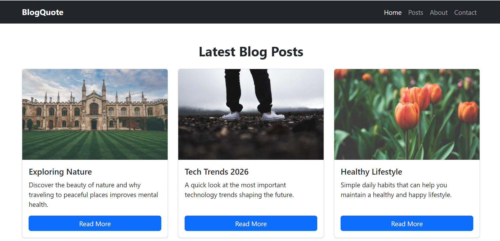

--> Bootstrap Blog Layout
A responsive blog webpage built using "Bootstrap 5 CDN".
This project demonstrates how to create a modern blog layout with a navbar, responsive card grid, and footer with social icons.

--> Objective
* Use Bootstrap 5 CDN
* Build responsive navbar
* Display blog posts using cards
* Arrange cards using Bootstrap grid
* Add footer with social icons
* Ensure full responsiveness

--> Tools Used
* VS Code
* Bootstrap 5 (CDN)
* Bootstrap Icons
* HTML5
* Chrome Browser

--> Project Structure``
bootstrap-blog/
│
└── index.html

--> Features
✅ Responsive navbar with hamburger menu
✅ Blog cards with images and buttons
✅ Bootstrap grid layout
✅ Mobile-first responsive design
✅ Footer with social media icons
✅ Clean and modern UI
✅ Utility classes for spacing and styling

--> Responsiveness
The layout adapts automatically:
*  Mobile → 1 card per row
*  Tablet → 2 cards per row
*  Desktop → 3 cards per row

--> How to Run Locally
1. Download or clone the repository
2. Open the project folder in VS Code
3. Open `index.html`
4. Run using Live Server "or" double-click the file

--> Bootstrap CDN Used
"CSS"`
https://cdn.jsdelivr.net/npm/bootstrap@5.3.3/dist/css/bootstrap.min.css
"JS"
https://cdn.jsdelivr.net/npm/bootstrap@5.3.3/dist/js/bootstrap.bundle.min.js

"Bootstrap Icons"
https://cdn.jsdelivr.net/npm/bootstrap-icons@1.11.3/font/bootstrap-icons.css

--> Mobile View

-->Tablet View

--> Desktop View

--> Learning Outcome
* Understanding Bootstrap grid system
* Using Bootstrap components
* Working with CDN links
* Building responsive layouts
* Using utility classes effectively

--> Future Improvements
* Add blog detail page
* Add search functionality
* Add dark/light mode
* Fetch blog posts dynamically
* Add animations and hover effects

